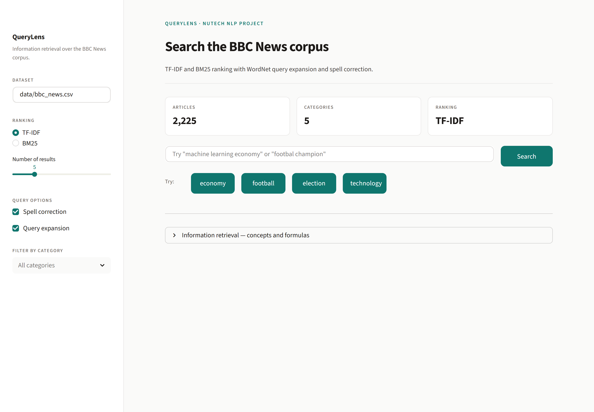
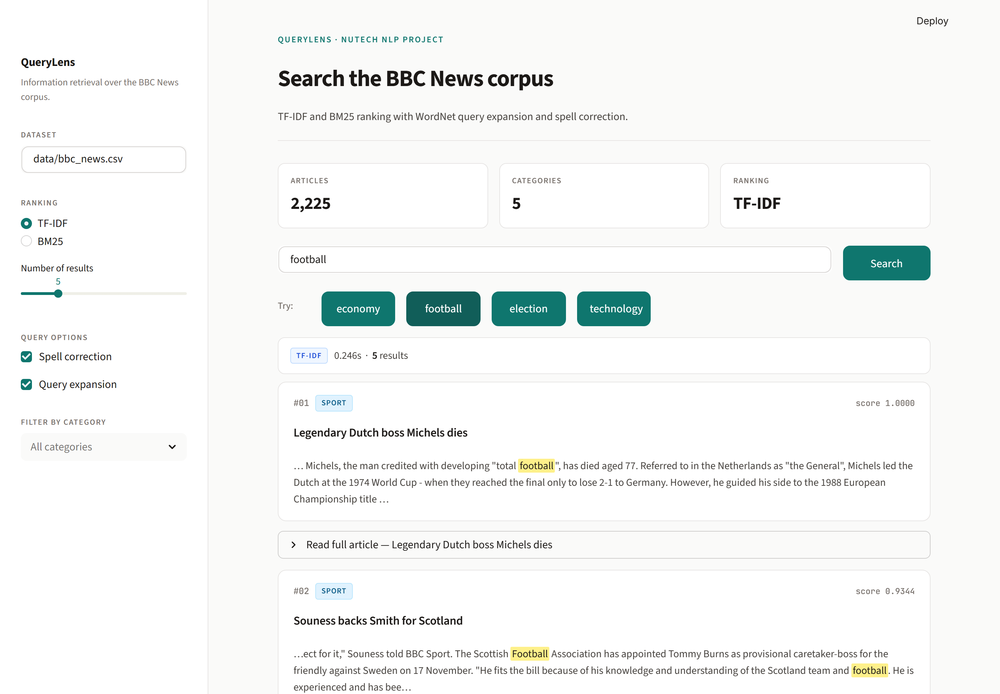

# 🔍 QueryLens Search Engine

> An information retrieval and NLP project for the BBC News corpus.
> National University of Technology · Department of Computer Science

QueryLens is a Streamlit application that ranks BBC News articles by relevance
to a user query. It implements two classical IR models — TF-IDF with cosine
similarity and BM25 — and layers WordNet query expansion and spell correction
on top to improve recall and precision.

## Screenshots

**Home — corpus overview, ranking controls, category filter:**



**Results — spell correction, query expansion, highlighted snippets:**



## Dataset

QueryLens is built and evaluated against the **BBC News Dataset**, a benchmark
corpus widely used for information retrieval and text classification.

| Property            | Value                                                        |
| ------------------- | ------------------------------------------------------------ |
| Total articles      | 2,225                                                        |
| Format              | Structured CSV (`title`, `content`, `category`)              |
| Categories          | Business, Entertainment, Politics, Sport, Tech               |
| Indexing strategy   | Full-text indexing on `content`; `title` weighted separately |

## Quick start

### Local environment

```bash
python -m venv venv
# Windows: venv\Scripts\activate
# macOS/Linux: source venv/bin/activate

pip install -r requirements.txt
streamlit run app.py
```

The first run downloads NLTK resources (~30 MB) and builds the index over the
2,225 articles in `data/bbc_news.csv`. Subsequent runs are instant thanks to
Streamlit's resource cache.

### Docker

```bash
docker compose up --build
```

Then open <http://localhost:8501>. The dataset is bind-mounted from `./data`
so swapping the CSV does not require a rebuild.

## Project layout

| Path                | Role                                                        |
| ------------------- | ----------------------------------------------------------- |
| `app.py`            | Streamlit UI, session state, rendering of results.          |
| `search_engine.py`  | Indexing, ranking (TF-IDF / BM25), spell + expansion.       |
| `preprocessing.py`  | Lowercasing, tokenisation, stop-word removal, lemmatisation. |
| `data/bbc_news.csv` | The corpus (2,225 articles · 5 categories).                  |
| `Dockerfile`        | Reproducible runtime image (Python 3.11-slim).               |
| `docker-compose.yml`| Single-service compose stack with health check.              |

## How a query is served

1. **Spell correction** — unknown lowercase tokens are checked against
   `pyspellchecker`. Proper nouns (capitalised tokens) are preserved as-is.
2. **Query expansion** — each token is lemmatised, then up to two WordNet
   synonyms are added to widen recall.
3. **Preprocessing** — the expanded query goes through the same pipeline used
   for indexing: lowercasing, punctuation stripping, stop-word removal,
   lemmatisation.
4. **Scoring** — TF-IDF cosine similarity or BM25, depending on the sidebar
   toggle. An optional category filter zeros out scores for non-matching docs.
5. **Presentation** — top-`k` results are returned with snippet windows in
   which matched query terms are wrapped in `<mark>` for highlighting.

## Ranking models

### TF-IDF

Term Frequency–Inverse Document Frequency weights how distinctive a term is
to a document relative to the corpus.

```
tf(t, d)  = count(t in d) / |d|
idf(t)    = log(N / (1 + df_t))
tfidf     = tf · idf
```

Documents and queries are represented as TF-IDF vectors and compared with
cosine similarity:

```
sim(q, d) = (q · d) / (‖q‖ · ‖d‖)
```

### BM25

BM25 (Best Match 25) is a probabilistic ranking model with term-frequency
saturation and document-length normalisation:

```
score(D, Q) = Σ IDF(q) · [f(q,D) · (k1 + 1)]
                       / [f(q,D) + k1 · (1 − b + b · |D| / avgdl)]
```

Defaults: `k1 = 1.5`, `b = 0.75`. BM25 generally outperforms raw TF-IDF on
mixed-length corpora.

## Comparing the two

| Property              | TF-IDF + cosine     | BM25                   |
| --------------------- | ------------------- | ---------------------- |
| Term saturation       | No                  | Yes (`k1`)             |
| Length normalisation  | Implicit (cosine)   | Explicit (`b`)         |
| Best for              | Short, similar docs | Mixed-length corpora   |
| Cost to build         | One sparse matrix   | One token-frequency map |

## Configuration

Sidebar controls in the running app:

- **Ranking method** — TF-IDF or BM25
- **Number of results** — 1–20
- **Categories** — filter to one or more BBC categories
- **Spell correction** — toggle on/off
- **Query expansion** — toggle on/off
  
## Features

- TF-IDF based document ranking for relevance scoring  
- BM25 algorithm used as an improved ranking alternative  
- Spell correction to fix user query errors before processing  
- Query expansion using synonyms to improve recall  
- Title matching to boost documents with direct query relevance  
- Keyword overlap for semantic similarity detection  
- Query coverage scoring to measure completeness of results  
- Weighted scoring function to combine all features into final rank  
- Simple HTML and CSS based frontend for user interaction  
- Lightweight Python backend for fast processing and indexing
  
## Team

National University of Technology (NUTECH) · Department of Computer Science

| Name           | Email                            |
| -------------- | -------------------------------- |
| Eman Asghar    | emankainif23@nutech.edu.pk       |
| Aena Habib     | aenahabibf23@nutech.edu.pk       |
| Dua Kamal      | duakamalf23@nutech.edu.pk        |
| Aleena Tahir   | aleenatahirf23@nutech.edu.pk     |
| Saqlain Abbas  | saqlainabbasf23@nutech.edu.pk    |

## License

MIT. Copyright (c) 2026 QueryLens.
